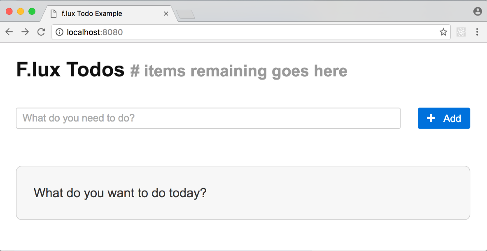

# Step 0 - Boilerplate Review

The code in the `examples/tutorial/step-0` directory contains a React based UI for the Todo application without any real functionality.

## Setup

Each step will use the same setup and run instruction as listed in each directory's README.md files. Here are the steps:

1. Install webpack globally:

	> npm install webpack -g

2. Install dependencies:

	> npm install

3. Compile the javascript code:

	> webpack

4. Open the `public/index.html` in a web browser

5. To run using webpack hot reloader (not React Hot Reloader module)
	1. Start the webpack dev server: `npm start`
	2. Point browser to: `http://localhost:8080/`

## The User Interface

Performing these steps will display the starting point application:

## Files

### `main.js`

Loads the babel polyfill for es2015 support and renders the `<Todos>` component into the `index.html` file.

### `Todos.react.js`

The top level UI component. The current version creates an `<h1>` title, displays the `<AddTodo>` component, and renders a notice that there are no Todo items.

### `AddTodo.react.js`

Implements the `<AddTodo>` component that will create new Todo items after the next step. For now, it renders an input for the Todo description and an 'Add' button. There is a stubbed method called `addTodo()` that will create a new Todo item after the next step.

## Next Step

The next step in the tutorial will create an f.lux store and implement adding, editing, and deleting todo items.

[Step 1: Create a f.lux store and basic todo item functionality](step-1.md)