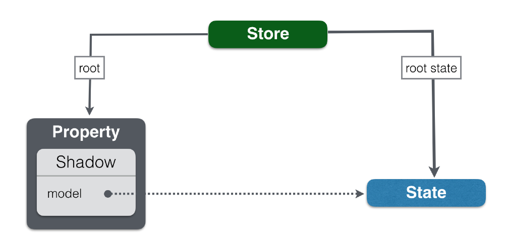
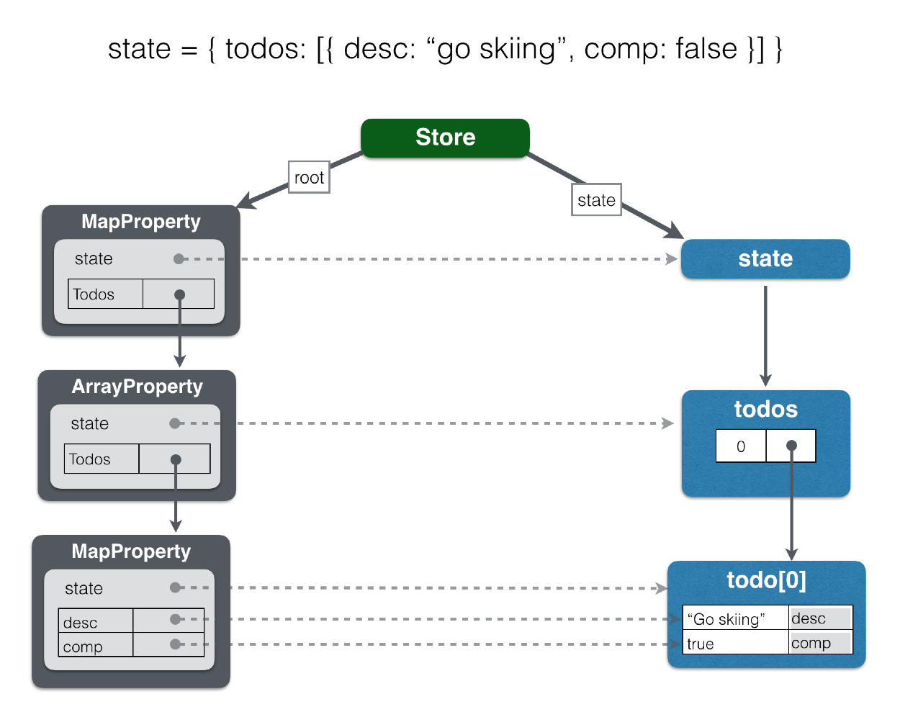

# Step 1: F.lux Store and Basic Todo Functionality

## Goals

1. [Create a f.lux `Store` with initial state](#user-content-store)
2. [Subscribe to store changes in `<Todos>`](#user-content-changes)
3. [Implement `<AddTodo>` `addTodo()` function](#user-content-addtodo)
4. [Implement `<TodoItem>` to display, edit, and delete todo items](#user-content-items)
5. [Iterate all store todo items and create a `<TodoItem>` for each one](#user-content-iterate)

The [`examples/tutorial/step-1`](https://github.com/akrumel/f.lux/tree/master/examples/tutorial/step-1) directory contains the completed code for this step.


## Technical background

F.lux stores all application state in a single object tree. A single source of truth greatly simplifies application state management, reduces complexity, and eases debugging. The f.lux store efficiently virtualizes the state tree into a shadow state as inspired by the React shadow DOM. The virtualization process, called shadowing, binds action-type functions onto the state tree properties. Binding the functions with the data makes explicit the operations that may be performed on a state tree property. Shadowing is recursively applied to the entire state tree. For performance reasons, the process occurs on a just-in-time basis so only the accessed properties are virtualized.

F.lux uses the `Store` class for representing stores. The following image shows how the store exposes the root state and the root property. Inside the root property is its shadow, which contains a reference to the actual state.



The application works with shadow objects that are accessed just like traditional javascript objects. This means your application logic looks "normal" and you can interact and inspect state objects in the javascript console like regular objects. The shadow objects are immutable so interacting with them through property assignments and function invocation result in actions being dispatched to the store for in order processing. The store then generates a change event on the next tick for the application to process the new state.

The next image shows how a list of one todo item would be shadowed:



The types of properties are shown in dark gray box titles. Out of the box, f.lux will recursively 'autoshadow' the state to automatically map `Property` subclasses onto the application state. The next step will cover specifying mapping instructions. Autoshadowing performs the following javascript type to f.lux type mapping:

| Javascript type              | f.lux `Property` subclass | API
| ---------------------------- | ------------------------- | -------------------------------
| Array.isArray(type)          | `ArrayProperty`           | [Array]
| lodash.isPlainObject(type)   | 'MapProperty'             | [Map]
| all others                   | `PrimitiveProperty`       | exposes the actual value

F.lux enables normal Javascript coding syntax to access and manipulate the shadow state in a [Flux] compatible way. The shadow state is immutable so all mutations, whether through assignment or functions/methods will generate f.lux actions that will change the actual state and generate store change notifications to registered listeners. Some examples of code used and described in the following sections to get the concepts flowing:

* `Array.map()`

```
todos.map( t => <TodoItem todo={ t } todos={ todos } /> )
```

* JSX `<input defaultValue={ .... } onChange={ event => ... } />`

```jsx
<input type="text"
	onChange={ event => todo.desc = event.target.value }
	defaultValue={ todo.desc }
/>
```

* `Array.indexOf()` and `Array.remove()`

```js
export default class TodoItem extends Component {
	removeTodo() {
		const { todo, todos } = this.props;
		const idx = todos.indexOf(todo);

		if (idx !== -1) {
			todos.remove(idx);
		}
	}


	render() {
		...
	}
}
```


## 1. Create a f.lux `Store` with initial state<a name="store" />

Add the following lines to `main.js` to create the application's f.lux store:

```js
import {
	Store,
	ObjectProperty
} from "f.lux";


// create the store and starting state
const root = new ObjectProperty();
const state = { todos: [] }
const store = new Store(root, state);
```

A f.lux based application uses a single store for managing all state. A `Store` instance is created by specifying a root property and the initial state. The property must be a `Property` subclass and the state a JSON compatible value of appropriate type for the root `Property`. In this case, an `ObjectProperty` instance is used to shadow, or proxy, a javascript literal object representing the application state. `ObjectProperty` is used to represent javascript literal objects and does not expose the rich `Map` api for adding and removing properties. `ObjectProperty` is useful when you have a well-defined object that does not require the functionality of a flexible, changing property list.

Drilling down into the initial state and adding an initial todo item:
```js
{
	todos: [
    	{ desc: "Go skiing!", completed: false }
	]
}
```

Autoshadowing will result with the following shadow property mapping:

* `todos`: `ArrayProperty`
* `todos` elements: `MapProperty` since these will be objects with a `desc` and `completed` flag
* `comp`: `PrimitiveProperty` will shadow the todo item's `string` property
* `completed`: `PrimitiveProperty` will shadow the todo item's `boolean` property


The final change to `main.js` is to pass the `store` to the `<Todos>` component using:

```jsx
ReactDOM.render(
	<Todos store={ store }/>,
	document.getElementById('react-ui')
);
```


## 2. Subscribe to store changes in `<Todos>`<a id="changes" />

A React component subscribes with the store to be notified when the state changes as a result of f.lux actions. The store exposes the following methods for this purpose:

* `subscribe(callback)` - the store will invoke the callback upon state changes
* `unsubscribe(callback)` - removes the callback from futher notifications

The `callback` parameter has the following signature:

```
callback(store, shadow, prevShadow)
```

The top level `<Todos>` React component will be used to subscribe to state changes.

```js
class Todos extends Component {
	componentWillMount() {
		const { store } = this.props;

		// bind onStateChange callback so can use it to register/unregister
		this.onStateChangeCallback = this.onStateChange.bind(this);

		// register for store change notificiations
		store.subscribe(this.onStateChangeCallback);
	}

	componentWillUnmount() {
		const { store } = this.props;

		store.unsubscribe(this.onStateChangeCallback);
	}

	onStateChange() {
		// brute force update entire UI on store change to keep demo app simple
		this.forceUpdate();
	}
```

The `<Todos>` component can now refresh the user interface each time the store's state changes. `<Todos>` has an `<h1>` header with the number of incomplete items and is implemented with this change:

```js
render() {
	const { todos } = this.props.store.shadow;
	const numIncomplete = todos.filter( t => !t.completed ).length;
	const remainingText = `${ numIncomplete } ${ pluralize("item", numIncomplete ) } remaining`;

	return <div className="todoContainer">
			<h1> F.lux Todos <small>{ remainingText }</small></h1>

			<AddTodo todos={ todos } />

			{ this.renderTodos() }
		</div>
}
```

Here are the important sections broken down:

* `const { todos } = this.props.store.shadow;`

	The shadow state is accessed using the `store.shadow` property. The `todos` variable is a shadow reference to the actual state array. Use `todos` just as you would a normal array and any mutations will be asynchronously applied through generated actions.

	Remember, the initial state has the form: `{ todos: [] }`.


* `const numIncomplete = todos.filter( t => !t.completed ).length;`

	This statement uses the Array `filter(iter)` method to obtain an array of incomplete items, `!t.completed`, and then takes the filtered array's length.
	

* `const remainingText = ``${ numIncomplete } ${ pluralize("item", numIncomplete ) } remaining``;`

	Format text to be placed in the application header for the number of items remaing. Uses the [pluralize](https://github.com/blakeembrey/pluralize) library to have the proper form of "items".

* `<h1> F.lux Todos <small>{ remainingText }</small></h1>`

	Render the header with the number of incomplete items.

* `<AddTodo todos={ todos } />`

	The `<AddTodo>` component will need to `todos` shadow array to add a new item.
	

## 3. Implement `<AddTodo>` `addTodo()` function<a id="addtodo" />

The `<AddTodo>` component is now receiving a property containing the `todos` shadow array. This is used to implement the `addTodo()` function:

```js
class AddTodo extends Component {
	addTodo() {
		const { todos } = this.props;
		const desc = this.todoInput.value;

		// Create a new Todo item
		const todo = {
			completed: false,
			desc,
			created: moment().toISOString()
		}

		// add the Todo item to the array
		todos.push(todo);

		// clear the input
		todoInput.value = "";
	}
```

[Step 2](step-2.md) in this tutorial will move this logic to a property but for now the logic is inlined in the component for ease or readability and allow the focus to remain on interacting with the shadow state. 

Here are the key points explained:

* `const { todos } = this.props;`

	Get the shadow array from the property set by `<Todos>` component. Remember, this is a shadow array that proxies the actual state array.
	
	
* `const desc = this.todoInput.value;`

	This gets the value from the `<input ref={ ref => this.todoInput = ref } />` containing the descirption for the new todo item.
	

* `const todo = { completed: false, desc, created: moment().toISOString() }`

	Creates the todo item state to be appended to the `todos` array. This will be encapsulated into a property function in [Step 2](step-2.md). Notice a Todo item has three properties: 
	
	- `completed` - boolean to indicate if item is done
	- `desc` - the description
	- `created` - ISO 8601 formatted string for time item created
	

* `todos.push(todo);`

	Just like a normal array, the new Todo item is appended to the shadow array. This will result in a store change notification to the `<Todos>` component that will trigger a `render()` call.


## 4. Implement `<TodoItem>` to display, edit, and delete todo items<a id="items" />

A `<TodoItem>` displays three components on a single line:

* Checked/unchecked icon: shows the completed state and a click will toggle the `completed` value.
* Input: displays and allows editing the item's description (`desc`).
* Remove icon: clicking icon will delete the item.

Here is the full source for the component:

```js
class TodoItem extends Component {
	removeTodo() {
		const { todo, todos } = this.props;
		const idx = todos.indexOf(todo);

		if (idx !== -1) {
			todos.remove(idx);
		}
	}

	handleToggleCompleted() {
		const { todo } = this.props;

		// toggle the completed flag
		todo.completed = !todo.completed;
	}

	render() {
		const { todo } = this.props;
		const { completed, desc } = todo;
		const descClasses = classnames("todoItem-desc", {
				"todoItem-descCompleted": completed
			});
		const completedClasses = classnames("todoItem-completed fa", {
				"fa-check-square-o todoItem-completedChecked": completed,
				"fa-square-o": !completed,
			});

		return <div className="todoItem">
				<i className={ completedClasses } onClick={ () => this.handleToggleCompleted() } />

				<input
					type="text"
					className={ descClasses }
					onChange={ event => todo.desc = event.target.value }
					defaultValue={ desc }
				/>

				<i className="todoItem-delete fa fa-times" onClick={ () => this.removeTodo() }/>
			</div>
	}
}
```

Let's start the discussion with the `render()` function:

* `const { completed, desc } = todo` 

	Gets the 'completed' and 'desc' properties from the 'todo' property. The next part of this step will show how this is set by doing a `todos.map( t => <Todo todo={ t } />)` on the `todos` array.

* `<i className={ completedClasses } onClick={ () => this.handleToggleCompleted() } />` 

	Icon displays a checked box if the item is completed and an unchecked box otherwise. Clicking on the icon will call the components `handleToggleCompleted()` function (described below).

* `<input defaultValue={ desc } onChange={ event => todo.desc = event.target.value }/>` 

	Displays and allows the `desc` property to be edited. Notice this is not a bound `<input>` which is done to keep things simple. [Step 5: f.lux-react](step-5.md) will show an easy way to make this a bound component.
	
	The default value is the `desc` value.
	
	Each value change will cause the `onChange` event handler to be invoked. Now this is interesting:
	
	```js
	todo.desc = event.target.value
	```

	This statement assigns the `<input>` value (`event.target.value`) to the `todo.desc` property. Since `todo` and `desc` are proxies for the actual state, **this statement will generate an update action to set the `desc` state value. And your code looks like regular javascript.**
	
	
* `<i className="todoItem-delete fa fa-times" onClick={ () => this.removeTodo() }/>` 

	This icon provides the ability to delete an item. Clicking on the icon will call the component's `removeTodo()` function (described below).


Now let's examine the simple `handleToggleCompleted()` function:

* `const { todo } = this.props`

	Start by getting the todo item being edited.
	

* `todo.completed = !todo.completed`

	Normal javascript code for toggling a boolean value. The difference is the f.lux library will generate an action to set the items 'completed' flag in the store's actual state followed by an update notification to the `<Todos>` component.
	

And finally, the `removeTodo()` function:

* `const { todo, todos } = this.props`

	The function will need to find the index of the `todo` item in the `todos` array to remove it.
	

* `const idx = todos.indexOf(todo)`

	Uses the array `indexOf(value)` function to get the item's index. Again, this standard array function is being called on a shadow property. A value of -1 is returned if the value is not found.

* `todos.remove(idx)`

	The item is removed from the shadow array. This will generate an update action that will remove the corresponding todo item from the actual `todos` array in the store's state.


## 5. Iterate all store todo items and create a `<TodoItem>` for each one<a id="iterate" />

And finally, let's update `<Todos>` component to render a `<Todo>` component for each item in the `todos` array:

```js
renderTodos() {
	const { todos } = this.props.store._;

	if (todos.length) {
		return todos
			.sortBy('completed')
			.map( t => <TodoItem key={ t.$().pid() } todo={ t } todos={ todos } /> );
	} else {
		return <p className="noItems">What do you want to do today?</p>
	}
}
```

This function is called in `<Todos>` render function.

* `const { todos } = this.props.store._`

	`store._` is an alias for `store.shadow`. The variable name comes from the idea of a shadow on the ground, `_`, for an actual object.  


* `if (todos.length) {`

	Yet another array-like access on an array shadow property. If function or property exists on a normal javascript array then it exists on the shadow.

* `todos.sortBy('completed')`

	Oh, and there are a few extras. Array shadows have the regular [`sort(compareFunction)`][array-sort] function if that is your style. They have also been enhanced with the [lodash] inspired [`sortBy()`][lodash-sortby] function.
	

* `todos.map( t => <TodoItem key={ t.$().pid() } todo={ t } todos={ todos } /> )`

	Uses the array `map()` function to generate a `<Todo>` component for each value in the `todos` shadow array. This all pretty normal stuff by now except the `key` property:
	
	```js
	key={ t.$().pid() }
	```
	
	Each shadow property receives a `$()` function to get the **f.lux accessor**. The accessor provides context information for a property. In this case, `pid()` gets the unique *property ID* identifying this property, a monotomically increasing number. 
	
	Some other interesting accessor functions:
	
	* `dotPath()` - gets the path to the property. For example, a todo item's path might be `todos.0`. Handy for debugging and form validation error highlighting.
	* `isReadonly()` - f.lux provides the ability to specify values should be readonly (assignment will have no affect)
	* `nextState()` - the properties state following any pending actions
	* `store()` - the store containing the property
	


[Step 2: Properties](step-2.md)


[Array]: https://developer.mozilla.org/en-US/docs/Web/JavaScript/Reference/Global_Objects/Array
[array-sort]: (https://developer.mozilla.org/en-US/docs/Web/JavaScript/Reference/Global_Objects/Array/sort)
[Flux]: https://facebook.github.io/flux/
[lodash]: https://lodash.com/
[lodash-sortby]: https://lodash.com/docs/4.17.4#sortBy
[Map]: https://developer.mozilla.org/en-US/docs/Web/JavaScript/Reference/Global_Objects/Map

