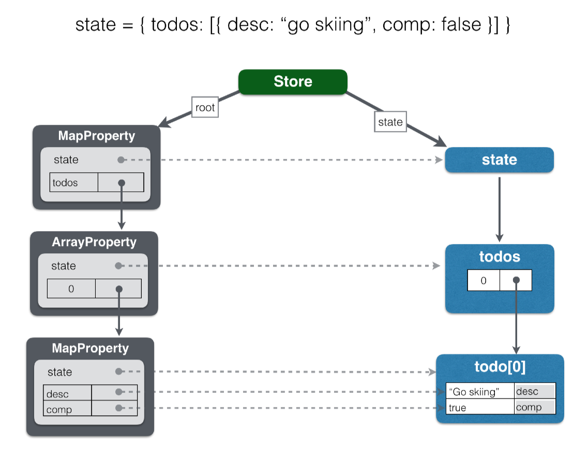

# Step 1: F.lux Store and Basic Todo Functionality

## Goals

1. [Create a f.lux `Store` with initial state](#user-content-store)
2. [Subscribe to store changes in `<Todos>`](#user-content-changes)
3. [Implement `<AddTodo>` `addTodo()` function](#user-content-addtodo)
4. [Implement `<TodoItem>` to display, edit, and delete todo items](#user-content-items)
5. [Iterate all store todo items and create a `<TodoItem>` for each one](#user-content-iterate)

The `examples/tutorial/step-1` directory contains the completed code for this step.


## Technical background

F.lux stores all application state in a single object tree. A single source of truth greatly simplifies application state management, reduces complexity, and eases debugging. The f.lux store efficiently virtualizes the state tree into a shadow state as inspired by the React shadow DOM. The virtualization process, called shadowing, binds action-type functions onto the state tree properties. Binding the functions with the data makes explicit the operations that may be performed on a state tree property. Shadowing is recursively applied to the entire state tree. For performance reasons, the process occurs on a just-in-time basis so only the accessed properties are virtualized.

F.lux uses the `Store` class for representing stores. The following image shows how the store exposes the root state and the root property. Inside the root property is its shadow, which contains a reference to the actual state.


The application works with shadow objects that are accessed just like traditional javascript objects. This means your application logic looks "normal" and you can interact and inspect state objects in the javascript console like regular objects. The shadow objects are immutable so interacting with them through property assignments and function invocation result in actions being dispatched to the store for in order processing. The store then generates a change event on the next tick for the application to process the new state.

The next image shows how a list of one todo item would be shadowed:



The types of properties are shown in dark gray box titles. Out of the box, f.lux will recursively 'autoshadow' the state to automatically map `Property` subclasses onto the application state. The next step will cover specifying mapping instructions. Autoshadowing performs the following javascript type to f.lux type mapping:

| Javascript type              | f.lux `Property` subclass | API
| ---------------------------- | ------------------------- | -------------------------------
| Array.isArray(type)          | `ArrayProperty`           | [Array]
| lodash.isPlainObject(type)   | 'MapProperty'             | [Map]
| all others                   | `PrimitiveProperty`       | exposes the actual value

F.lux enables normal Javascript coding syntax to access and manipulate the shadow state in a [Flux] compatible way. The shadow state is immutable so all mutations, whether through assignment or functions/methods will generate f.lux actions that will change the actual state and generate store change notifications to registered listeners. Some examples of code used and described in the following sections to get the concepts flowing:

* `Array.map()`

```
todos.map( t => <TodoItem todo={ t } todos={ todos } /> )
```

* JSX `<input defaultValue={ .... } onChange={ event => ... } />`

```jsx
<input type="text"
	onChange={ event => todo.desc = event.target.value }
	defaultValue={ todo.desc }
/>
```

* `Array.indexOf()` and `Array.remove()`

```js
export default class TodoItem extends Component {
	removeTodo() {
		const { todo, todos } = this.props;
		const idx = todos.indexOf(todo);

		if (idx !== -1) {
			todos.remove(idx);
		}
	}


	render() {
		...
	}
}
```


## Create a f.lux `Store` with initial state<a name="store" />

Add the following lines to `main.js` to create the application's f.lux store:

```js
import {
	Store,
	ObjectProperty
} from "f.lux";


// create the store and starting state
const root = new ObjectProperty();
const state = { todos: [] }
const store = new Store(root, state);
```

A f.lux based application uses a single store for managing all state. A `Store` instance is created by specifying a root property and the initial state. The property must be a `Property` subclass and the state a JSON compatible value of appropriate type for the root `Property`. In this case, an `ObjectProperty` instance is used to shadow, or proxy, a javascript literal object representing the application state. `ObjectProperty` is used to represent javascript literal objects and does not expose the rich `Map` api for adding and removing properties. `ObjectProperty` is useful when you have a well-defined object that does not require the functionality of a flexible, changing property list.

Drilling down into the initial state and adding an initial todo item:
```js
{
	todos: [
    	{ desc: "Go skiing!", completed: false }
	]
}
```

Autoshadowing will result with the following shadow property mapping:

* `todos`: `ArrayProperty`
* `todos` elements: `MapProperty` since these will be objects with a `desc` and `completed` flag
* `comp`: `PrimitiveProperty` will shadow the todo item's `string` property
* `completed`: `PrimitiveProperty` will shadow the todo item's `boolean` property


The final change to `main.js` is to pass the `store` to the `<Todos>` component using:

```jsx
ReactDOM.render(
	<Todos store={ store }/>,
	document.getElementById('react-ui')
);
```


## Subscribe to store changes in `<Todos>`<a id="changes" />


## Implement `<AddTodo>` `addTodo()` function<a id="addtodo" />


## Implement `<TodoItem>` to display, edit, and delete todo items<a id="items" />


## Iterate all store todo items and create a `<TodoItem>` for each one<a id="iterate" />


[Step 2: Properties](step-2.md)


[Array]: https://developer.mozilla.org/en-US/docs/Web/JavaScript/Reference/Global_Objects/Array
[Flux]: https://facebook.github.io/flux/
[Map]: https://developer.mozilla.org/en-US/docs/Web/JavaScript/Reference/Global_Objects/Map
