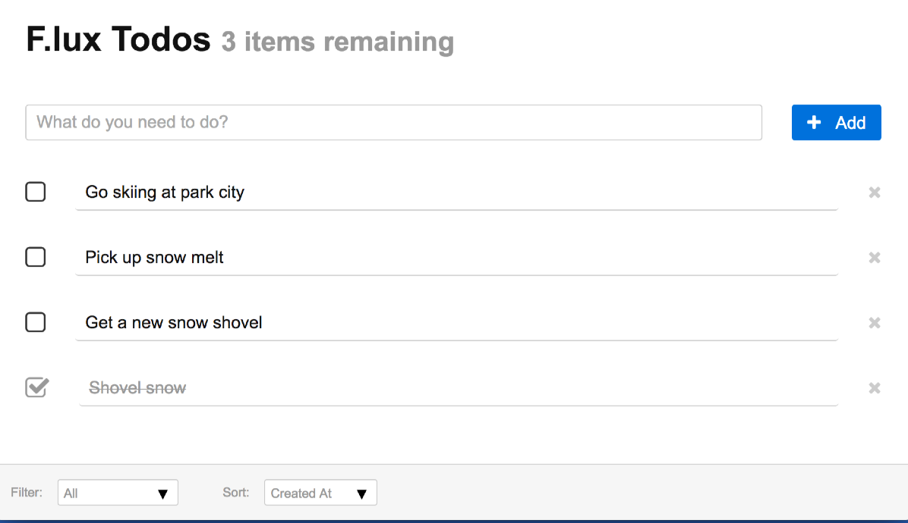

# Step 3: UI State 


## Overview

This step will implement a toolbar for filtering and sorting the todo items. The application state will be extended to include UI state for the desired functionality. 

Here is an application screenshot containing the toolbar: 

---



---


## Goals

1. [`UiProperty`](#user-content-uiproperty)
2. [Update `ToodRootProperty`](#user-content-root)
3. [`<FilterSelector>` and `<SortSelector>`](#user-content-selectors)
4. [Update `<Todos>`](#user-content-todos)

The [`examples/tutorial/step-3`](https://github.com/akrumel/f.lux/tree/master/examples/tutorial/step-3) directory contains the completed code for this step.


## Technical background

### Property accessor (`$()`)

Each shadow state property has a `$()` method for accessing the *property accessor.* The property accessor was used to generate a React component key in the previous steps:

```js
todos.map( t => <TodoItem key={ t.$().pid() } todo={ t } todos={ todos } /> );
```

The accessor contains methods for obtaining f.lux related information. The most commonly used property accessor methods include: 

* `dotPath()` - gets the path from the root shadow state to the referenced shadow state property. For example, a complex path could be `foo.bar.baz`.
* `latest()` - get a reference to the current shadow state property. Useful when an asynchronous call returns and the state may have been updated.
* `pid()` - gets the unqiue property id
* `rootShadow()` - gets the `Store` managed root shadow state object
* `state()` - gets the `Store` managed actual state (not the shadow state)
* `store()` - gets the `Store` containing the shadow state property

This tutorial step will use the `$().rootShadow()` method.


### Property initial state

The [previous step](step-2.md) initialized the `Store` with the following two lines:

```js
const root = new TodoRootProperty();
const store = new Store(root);
```
And was explained as:

> The `Store` obtains it from the `TodoRootProperty` instance passed into the constructor with the line:
>
> ```js
> state = root.initialState();
> ```
> 
> `initialState()` is a `Property` method and it uses `TodoRootProperty.type` to calculate it.

The initial state is computed recusively from the root until all descendents are non-objects, such as `null`, `undefined`, or a primitive. The initial state was implicitly set in the `createClass()` and `defineType()` static function calls. The third parameter to these static functions is the initial state, which receives an appropriate default if one is not explicitly passed. For example, here are the complete signatures for `ObjectProperty` static functions:

```js
static createClass(shadowType={}, specCallback, initialState={})

static defineType(PropClass, ShadowType, specCallback, initialState={})
```
Notice the initial state defaults to the empty object (`{}`).

Here is a table with the default initial states for each type:

| `Property` class       | default value
| ---------------------- | -------------------------
| `ArrayProperty`        |  `[]`
| `IndexedProperty`      |  `[]`
| `MapProperty`          |  `{}`
| `ObjectProperty`       |  `{}`
| `PrimitiveProperty`    |  N/A

The previous step's initial state was:

```js
{ todos: [] }
```

## 1. `UiProperty` <a id="uiproperty"/>

The `UiProperty` requires the following properties and method:

* `filter` - one of the following values where the values in parenthesis is the constant value defined in the `UiProperty.js` source file:
	- `all` - shows all items (`AllFilter`) 
	- `completed` - shows completed items only (`CompletedFilter`)
	- `incomplete` - hides completed items (`IncompleteFilter`)
	
* `sortBy` - one of the following values where the values in parenthesis is the constant value defined in the `UiProperty.js` source file:
	- `created` - oldest messages at the top (`CreatedSort`)
	- `desc` - sorted in ascending alphabetical order (`DescSort`)
	- `updated` - most recently modified/created items first (`UpdatedSort`)
	
* `visibleTodos()` - returns the `todos` items that meet the chosen `filter` and sorted according to the `sortBy` algorithm.


### Filters and sorters

This section involves filtering and sorting setup and is not related to f.lux. The `UiProperty.js` file exports constants for the filtering and sorting algorithms and the sets up the algorithm functions

```js
export const AllFilter = "all";
export const CompletedFilter = "completed";
export const IncompleteFilter = "incomplete";
const DefaultFilter = AllFilter;

export const CreatedSort = "created";
export const DescSort = "desc";
export const UpdatedSort = "updated";
const DefaultSort = CreatedSort;

/*
	Filter functions available for easy lookup.
*/
const filters = {
	[AllFilter]: t => true,
	[CompletedFilter]: t => t.completed,
	[IncompleteFilter]: t => !t.completed,
};

/*
	Sort functions available for easy lookup. Each function is setup to return incomplete items
	before completed items.
*/
const sorters = {
	[CreatedSort]: (t1, t2) => t1.completed == t2.completed ?t1.momentCreated - t2.momentCreated :t1.completed,
	[DescSort]: (t1, t2) => t1.completed == t2.completed ?t1.desc.localeCompare(t2.desc) :t1.completed,
	[UpdatedSort]: (t1, t2) => t1.completed == t2.completed ?t2.momentUpdated - t1.momentUpdated :t1.completed,
}

```

Notice how the sorting functions sort incomplete items first followed by the selected algorithm.
 

### `UiProperty` definition

`UiProperty` is an `ObjectProperty` with a `Shadow` subclass as the shadow api. The `UiProperty` class is not explicitly defined since the f.lux property life-cycle is not required.

```js
class UiShadow extends Shadow {
	visibleTodos() {
		const { todos } = this.$().rootShadow();
		const { filter, sortBy } = this;
		const filterFn = filters[filter] || filters[DefaultFilter];
		const sortFn = sorters[sortBy] || sorters[DefaultSort];

		return todos.filter(filterFn).sort(sortFn);
	}
}


export default ObjectProperty.createClass(UiShadow, type => {
	type.properties({
				filter: PrimitiveProperty.type.initialState(DefaultFilter),
				sortBy: PrimitiveProperty.type.initialState(DefaultSort)
			})
		.readonlyOff
		.typeName("UiProperty");
});
```

* `this.$().rootShadow()`

	The React UI uses the `UiShadow.visibleTodos()` method to retrieve the filtered and sorted todo items for rendering. The key f.lux related code is the `$().rootShadow()` call. This returns the `Store` managed shadow property of type `RootTodoProperty` defined in the [previous step](step-2.md). We then get the `todos` shadow state property and call the array methods `filter()` and `sort()`:
	
	```js
	const { todos } = this.$().rootShadow();

	return todos.filter(filterFn).sort(sortFn);
	```

* `const { filter, sortBy } = this`

	A `Shadow` method's `this` reference points to the shadow state. We use `this` to get the `filter` and `sortBy` shadow property values, which will be native javascript strings since they are both defined using `PrimitiveProperty.type` and are initialized using string values. The `filter` and `sortBy` string values are used to lookup the appropriate callback functions:

	```js
	const filterFn = filters[filter] || filters[DefaultFilter];
	const sortFn = sorters[sortBy] || sorters[DefaultSort];

	return todos.filter(filterFn).sort(sortFn);
	```

* Property initial state

	The `filter` and `sortBy` properties are assigned initial values using in the `type` setup callback:

	```js
	type.properties({
			filter: PrimitiveProperty.type.initialState(DefaultFilter),
			sortBy: PrimitiveProperty.type.initialState(DefaultSort)
		})
	```

	We will see how the initial values look in the next section.


## 2. Update `ToodRootProperty` <a id="root" />

The `UiProperty` is accessed via the `ui` property off the root shadow state:

```js
export default ObjectProperty.createClass({}, type => {
	type.autoshadowOff                          
		.properties({
				todos: TodoListProperty.type,
				ui: UiProperty.type,             // add UiProperty to state
			})
		.readonly                               
		.typeName("TodoRootProperty");          
});
```

And now the `Store` initial state is:

```js
{
	todos: [],
	ui: {
		filter: "all",
		sortBy: "created"
	}
}
```


## 3. `<FilterSelector>` and `<SortSelector>` <a id="selectors" />

Both components are idiomatically the same so this section will focus on just one, `<FilterSelector>`:

```js
import React from "react";
import { AllFilter, CompletedFilter, IncompleteFilter } from "./UiProperty";

export default function FilterSelector(props, context) {
	const { ui } = props;

	return <div className="tools-selector">
			<span>Filter:</span>

			<select onChange={ e => ui.filter = e.target.value }>
				<option value={ AllFilter }>All</option>
				<option value={ CompletedFilter }>Completed</option>
				<option value={ IncompleteFilter }>Not Completed</option>
			</select>
		</div>
}
```

A few points worth calling out:

* `import { AllFilter, CompletedFilter, IncompleteFilter } from "./UiProperty";`

	This demonstrates how f.lux introduces a natural organization to an application's structure without explicitly imposing one. Defining and exporting the filter and sorting constants from the `UiProperty` module just feels right (to me at least).


* `<select onChange={ e => ui.filter = e.target.value } >`

	The `ui` property is the `UiProperty` shadow state property and we will see how this is obtained in the next section.
	
	Updating the `ui.filter` property uses a simple assignment in the `onChange()` event callback. The assignment will trigger an f.lux property update action followed by a store update notification to registered listeners, the `<Todos>` component in this application.
	
	That's it!


## 4. Update `<Todos>` <a id="todos" />

Finally, let's update the `<Todos>` component to show the toolbar and utilize the `UiProperty.visibleTodos()` method to get the filtered and sorted items:

### Render the toolbar

Here is the `render()` function:

```js
render() {
	const { todos, ui } = this.props.store._;
	const remainingText = `${ todos.incompleteSize } ${ pluralize("item", todos.incompleteSize ) } remaining`;

	return <div className="todoContainer">
			<h1>
				F.lux Todos <small>{ remainingText }</small>
			</h1>

			<AddTodo todos={ todos } />

			{ this.renderTodos() }

			<div className="tools">
				<FilterSelector ui={ ui } />
				<SortSelector ui={ ui } />
			</div>
		</div>
}
```

And here are the interesting additions:

* `const { todos, ui } = this.props.store._;`

	The `ui` property is stored in the root shadow state.
	
* The toolbar

	Just a bit of JSX that passes the `ui` shadow state property to the `<FilterSelector>` and `<SortSelector>` components:

	```jsx
	<div className="tools">
		<FilterSelector ui={ ui } />
		<SortSelector ui={ ui } />
	</div>
	```

### Update `renderTodos()`

Filtering introduces a few additional requirements:

* **No visible items** - the list may contain items that do not satisfy the current filter criteria, ie no completed items.
* **Display properly sorted and filtered items** - this is simple with our new `UiProperty.visibleTodos()` shadow method.

And here is the updated `renderTodos()` function:

```jsx
renderTodos() {
	const { todos, ui } = this.props.store._;
	const visibleTodos = ui.visibleTodos();

	if (visibleTodos.length) {
		return visibleTodos.map( t => <TodoItem key={ t.$().pid() } todo={ t } todos={ todos } /> );
	} else if (todos.length === 0) {
		return <p className="noItems">What do you want to do today?</p>
	} else {
		return <p className="noItems">No items are { ui.filter }</p>
	}
}
```

And a few points explained:

* `const visibleTodos = ui.visibleTodos();`

	The previous step simply used the `todos` array shadow property directly and employed some inline sorting. The filtering and sorting is delegated to the `UiProperty` which maintains the filter and sorting criteria.

* `visibleTodos.map( t => <TodoItem key={ t.$().pid() } todo={ t } todos={ todos } /> );`	
	
 	The `visibleTodos` is mapped but each `<TodoItem>`. But notice the component's `todos` property:
 	
 	```jsx
 	<TodoItem ... todos={ todos } />
 	```

 	We still pass the `todos` array shadow property because the component needs access to the actual shadow state array for deleting the time when the 'x' icon is pressed. The `ui.visibleTodos()` return value is a native array so will be of no use for removing an item from the store's state. This trickiness will be banished by using the `f.lux-react` module in [next step](step-4.md).
 	
 	
## Final Thoughts

This tutorial step covered using the f.lux shadow state for maintaining user interface state. 

Important concepts covered include:

* Using `$().rootShadow()` property accessor method to access the `Store` managed root shadow object.
* Employ f.lux state to maintain user interface state and extract data manipulation logic.


## Next Step

[Step 4: `f.lux-react`](step-4.md)

