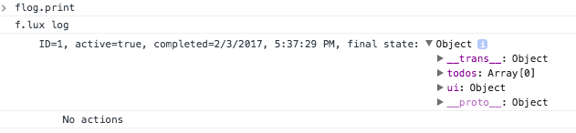
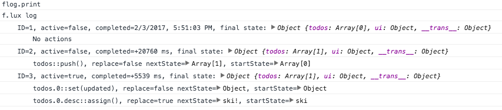
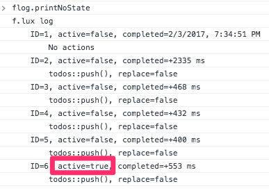
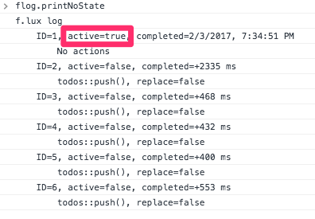

# Step 5: Time Travel Debugger

## Overview

This step will will explore using the f.lux time travel debugger and experiment with the shadow state from javascript console. 


## Goals

1. [Setting up the f.lux `Logger`](#logger)
2. [Logging](#logging)
3. [Time travel](#timetravel)
4. [Fun with shadow properties](#fun)


The [`examples/tutorial/step-5`](https://github.com/akrumel/f.lux/tree/master/examples/tutorial/step-4) directory contains the completed code for this step.


## 1. Setting up the f.lux `Logger` <a id="logger"/>

The `Store` class has a low-level api for tracking state change actions. F.lux ships with the `Logger` class that uses this low-level listener api for logging state changes and supporting time travel debugging. 

We make a small change to `main.js` to enable the `Logger`:

```js
import {
    Store,
    Logger as FluxLogger
} from "f.lux";


const root = new TodoRootProperty();
const store = new Store(root);

// add logger as a listener - avaible in console as 'flog'. Example usage: 'flog.print'
const logger = new FluxLogger(store);
store.addListener(logger);
``` 

Running the application in the browser will cause the following to be printed to the console:

```
f.lux logger commands:
    back          - moves backward in time by one store state frame
    clear         - removes all logs
    forward       - moves forward in time by one store state frame
    help          - f.lux logger commands
    index         - active index of store state frames
    maxFrames     - # of store updates to cache (default=50)
    next          - alias for 'forward'
    print         - print logs to console
    printNoState  - print logs to console without state objects
    size          - # of store state frames available
    store         - gets the f.lux store

Functions:
    clearTrap(name)                    - clears a trap set by 'setTrap()'
    goto(idx)                          - move to a specific store state frame
    setMaxFrames(maxFrames)            - set the maximum number of store states to maintain (default=50)
    setTrap(cond, value, name=uuid)    - sets a debugger trap and returns name. condition argument may be
                                         a function taking next state or a string path to get a value
    tail(count=10, printState=true)    - prints last 'count' store updates


f.lux log available at window.flog
```
We will explore many of these commands for the remainder of this step.


## 2. Logging <a id="logging"/>

Let's explore the logging commands. Open your browser's javascript console and type the following commands at the prompt.

1. `flog.print`

    Prints all state changes stored in the log. Running this command immediately after the application launches look the following once the `Object` is expanded:
    
    

    This describes the starting f.lux store state. 
    
    * `ID` - a log frame identifier
    * `active=true` - used for time travel debugging. The `true` means this frame represents the current f.lux store state.
    * `completed=...` - the timestamp for when the state change occurred. The first frame will show the timestamp and subsequent onces will print the time since the previous frame
    * `final state` - the actual f.lux store state (not shadow state)
    
2. Create a todo item and make a one character change. I created an item with "ski" as the description and added a '!' to the end. 

    Type `flog.print` and you should see output similar to this:    
    
    
    
    Now there are 3 frame:
    
    - `ID=1` - the initial frame
    - `ID=2` - `todos::push()` was the action and you can inspect the starting and ending property state for `todos`.
    - `ID=3` - the actions are shown ordered by the dotted path, ie 'todos.0' and 'todos.0.desc'. The two actions are to set the `desc` property and the `updated` timestamp property.
    
3. `flog.maxFrames`

    Command will print the number of log frames to maintain. The default is 50.
    
4. `flog.size`

    Command prints the number of log frames available.
    
5. Create some todo items and make some edits to increase the number of log frames.

6. `flog.tail(5)`

    The `tail(count=10)` will print the end of the log. This command is a function unlike the previous property type commands. The default is to print 10 frames. `flog.print` always prints the entire log.
    
7. `flog.store._.todos.length`
    
    The `flog.store` commands gets the f.lux store and `_` is the root shadow state. So this command gets the length of the `todos` shadow property. 
    
    You could also use `flog.store.shadow` if you prefer more typing. Btw, the choice of the '_' for accessing the shadow state was chosen because it "looks" like a shadow on the ground, right?
     
8. `flog.clear`

    Clears all log frames. Can be handy when you want to track some activity since all log data will relate to the activity of interest.
    
    
## 3. Time travel <a id="timetravel"/>

Time travel debugging is the ability to move back and forth between f.lux store state. Time travel debugging along with hot reloading can form a productive UI development environment. This section will simply explore the time travel commands and not perform any actual debugging tasks.

Make sure you have some todo items and have made a few edits so you `flog.size` shows between 5 - 10. This will give us enough for time travelling but still be manageable.

1. `flog.printNoState`

    This prints all the log frames, like `flog.print`, without the state objects. This makes for a smaller output. Here is my console screenshot:
    
    
    
    Notice the last frame has `active=true` indicating it is the f.lux store's current state.

2. `flog.goto(0)`

    This will reset the f.lux store to the state of the first log frame. You should see the UI revert to this state.
    
    
    
    And now the first log frame show `active=true`.
    
3. `flog.next`

    Moves the next log frame and you should see the ui update. 
    
4. `flog.back`

    Moves to the previous log frame.
    
5. `flog.index`

    Prints the current log frame index, ie `active=true`.
    
6. `flog.goto(flog.size - 1)`
    
    Goes to the last log frame.
    
    
## 4. Fun with shadow properties <a id="fun"/>

Working with the f.lux store shadow state can be a handy way to debug problems or just get a better understanding of f.lux.

1. Refresh the browser so you have no todo items.

2. `flog.store._.todos.addTodo("Hello")`

    You should see a todo item in the UI with the description "Hello". We accessed the `todos` shadow array, `TodosListProperty` type, and invoked the `addTodo()` method we defined in [Step 2: Properties](step-2.md#todos).
    
3. `flog.store._.todos[0].completed = true`

    And we just marked our new todo item as completed. You should the item marked in the application.

4. `flog.store._.todos`

    Prints out:
    
    ```js
    CustomShadow {__state__: Array[2], Symbol(impl): IndexedShadowImpl, Symbol(_cache): Object}
    ```
    
    Yep, not a real array. But what is the property type that backs the shadow?
    
5. `flog.store._.todos.$$()`

    Remember the `$$()` shadow method returns the `Property` instance. In this case, the console will print:
    
    ```js
    CustomProperty {_indexed: IndexedApi, Symbol(pid): 3, ...}
    ```
6. `flog.store._.todos.$$().typeName()`

    We are invoking the `Property.typeName()` method to get the `typeName` value set on the `TodoListProperty.type` descriptor. 
    
    ```js
    export default IndexedProperty.createClass(TodoListShadow, type => {
        type.elementType(TodoProperty.type)    // each model contained will be a TodoProperty type
            .typeName("TodoListProperty")      // useful for diagnostics
    });
    ```
    
    And sure enough, the console outputs `TodoListProperty`.

7. `flog.store._.todos.$$().stateType()`

    This gets the actual `StateType` instance used to shadow the `todos` state.

8. `flog.store._.todos = []`

    The console will output `[]` but the ui will not change. And running the command 
    
    ```js
    flog.store._.todos.toJSON()
    
    > [Object]
    ```
    
    shows there is still a single object in the array.
    
9. `flog.store._.todos.map( t => ``${t.desc}, ${t.updated}`` )`

    We are using the `Array.map()` method to print out information about all the todo items.
    

## Final Thoughts

This tutorial step covered setting up the f.lux `Logger` and using it to track state changs and time travel. We also messed around on the javascript console to manipulate the shadow state manually. 


